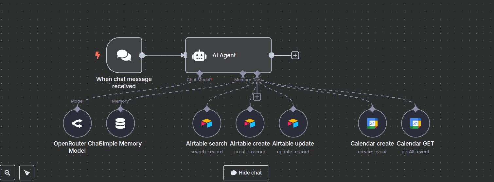

# 🦷 AI Dental Assistant (n8n + LangChain + Airtable + Google Calendar)

An AI-powered assistant for dental clinics that helps patients book appointments easily, built with [n8n.io](https://n8n.io), LangChain, OpenAI/OpenRouter, Airtable, and Google Calendar.

## 🚀 Features

- 🤖 Conversational AI assistant
- 📅 Google Calendar integration
- 📄 Airtable patient database
- 🧠 Memory tracking with LangChain
- 🔐 Secure credential setup

## 📦 Files

- `n8n-workflows/dental-ai-agent-workflow.json`: Main workflow
- `assets/`: Images 

## 🔧 Setup Instructions

1. Import the `.json` into n8n (`Import > From File`)
2. Create credentials in n8n:
   - `Airtable Token`
   - `Google Calendar OAuth2`
   - `OpenRouter API Key`
3. Replace placeholder values in credentials
4. Activate your webhook node and test

## 🖼️ Demo

